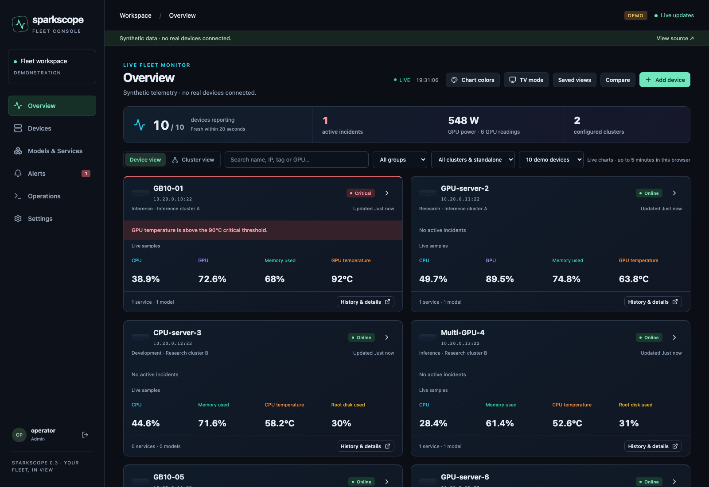
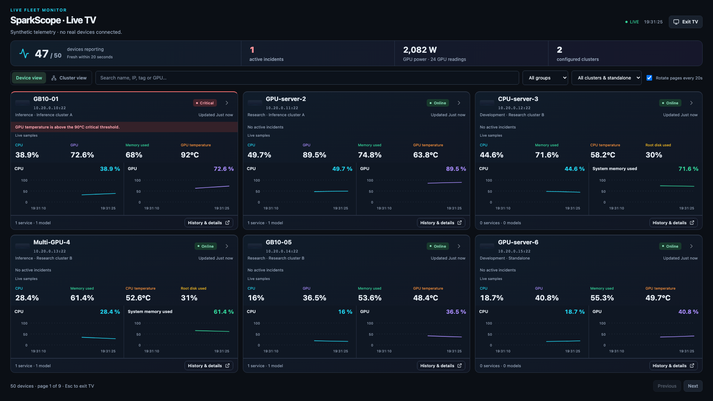
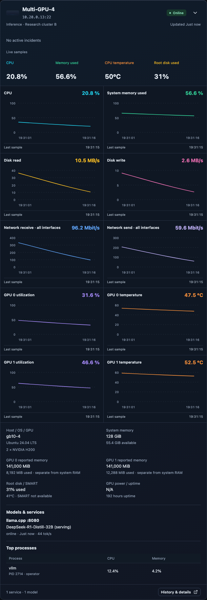
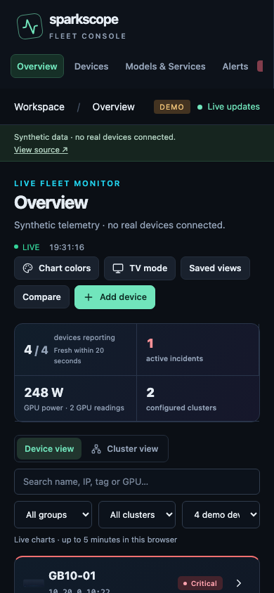

<div align="center">

# SparkScope

**Live monitoring for mixed Linux fleets — from GB10 workstations to multi-GPU servers.**

[](https://github.com/canberkys/sparkscope/releases/latest)
[](https://github.com/canberkys/sparkscope/actions/workflows/ci.yml)
[](https://canberkys.github.io/sparkscope/?hosts=10&hardware=mixed)
[](pyproject.toml)
[](LICENSE)

[Latest release](https://github.com/canberkys/sparkscope/releases/latest) · [Live demo](https://canberkys.github.io/sparkscope/?hosts=10&hardware=mixed) · [Installation](#installation) · [Add devices & GPUs](#add-devices--gpus) · [Monitoring guide](deployment/MONITORING.md) · [Changelog](CHANGELOG.md) · [Roadmap](ROADMAP.md)

</div>



*Demo screenshot: simulated devices and readings, not real hardware measurements.*

SparkScope collects telemetry over SSH and streams it to a live dashboard. Expand a device to inspect its hardware, compare GPU history, or use TV mode for a monitoring display. One inventory can contain CPU-only Linux hosts, GB10 systems, NVIDIA GPU workstations and servers with multiple GPUs.

**0.3 targets 10–50 devices.** Local automated and synthetic checks have passed; real GB10/dual-H200 acceptance, the reference-server 24-hour soak and previous-release rollback remain open. See [validation evidence](deployment/VALIDATION.md). This is not a production-readiness certification.

## What you can do

| Workflow | Capabilities |
| --- | --- |
| Monitor live | Expandable device cards, CPU/memory/disk/network readings, GPU-specific charts, freshness indicators and TV page rotation |
| Find and organize | Search names, IPs, tags and GPU models such as GB10, H200 or 4090; groups, explicit clusters and saved personal/shared views |
| Investigate | Timestamp-correct history with visible gaps, units and optional min/max bands; compare up to four devices/GPUs; incident/connectivity/service events |
| Understand inference | Discover vLLM, Ollama and llama.cpp services/models; show only metrics supported by the provider |
| Respond | Device/GPU alarm rules, acknowledgement, webhook/email notifications, maintenance windows and explicit-target whitelisted operations |
| Administer | Guided SSH trust, encrypted credentials, roles, device connection updates, pause/archive, backups and key rotation |

Live monitoring, expandable panels and TV mode carry forward the original dashboard's core workflows. The fleet release adds multi-user administration and mixed-hardware support around them.

## Requirements

The **SparkScope server** and the **devices it monitors** have different requirements:

| Location | Required | Optional / feature-specific |
| --- | --- | --- |
| SparkScope server, native install | Git, Python 3.11+, uv, Node.js 22 and npm for frontend builds; SSH network access to the devices | PostgreSQL for shared installations; SQLite is the local default |
| SparkScope server, container install | Docker Engine/Desktop with Compose v2 | HTTPS reverse proxy for team access; native Python/Node are not required on the host |
| Monitored device | Linux, reachable SSH, an account with the required read permissions and standard Linux tools | NVIDIA driver and working `nvidia-smi` for GPU telemetry; `curl` for runtime discovery; `nvme-cli` and suitable noninteractive permissions for NVMe SMART |
| Browser | A modern browser with JavaScript and WebSocket support | Playwright Chromium is needed only to run browser tests |

No SparkScope agent or Python/Node installation is required on the monitored devices. Docker service discovery requires that the SSH account can access Docker. Missing tools or privileges appear as unavailable measurements; onboarding does not install drivers or change permissions. macOS is used for local development; remote collection targets Linux.

## Installation

### Native: local workstation or Linux server

Install the required tools first and confirm their versions:

```bash
python3 --version   # Python 3.11+ (uv may manage a separate Python)
uv --version
node --version     # v22.x
npm --version
```

Clone and install from the committed lockfiles:

```bash
git clone https://github.com/canberkys/sparkscope.git
cd sparkscope
uv sync --locked --python 3.12
npm ci --prefix frontend
npm run build --prefix frontend
uv run python -m sparkscope.cli migrate
uv run uvicorn app:app --host 127.0.0.1 --port 8010 --workers 1 --no-access-log
```

Open **http://127.0.0.1:8010**. In a second terminal, from the same repository, run:

```bash
uv run python -m sparkscope.cli setup-code
```

Use that local setup code in the browser to create your first administrator. **There is no default username or password.** Keep the setup code private. Once an account exists, use the local password-reset CLI if recovery is needed.

The default SQLite database is `~/.sparkscope/fleet.db`; encrypted credentials depend on `~/.sparkscope/master.secret`. Back up the database **and its matching key**. Do not replace a key when moving an existing database.

### Docker / shared server

From a cloned repository:

```bash
# Set a long random URL-safe password in your shell or secret manager.
export POSTGRES_PASSWORD='REPLACE_WITH_A_LONG_RANDOM_URL_SAFE_PASSWORD'
docker compose -f deployment/compose.yaml up -d --build
docker compose -f deployment/compose.yaml exec app /app/.venv/bin/python -m sparkscope.cli setup-code
```

Compose includes PostgreSQL and persistent database/data/key volumes. Open **http://127.0.0.1:8010** on that host for first setup. For team access, configure an HTTPS reverse proxy, the exact `SPARKSCOPE_ORIGINS` value and `SPARKSCOPE_SECURE_COOKIE=1`; forward WebSocket upgrades. See the [operations guide](deployment/OPERATIONS.md) for deployment, permissions, backup/restore and rollback.

Run **one application worker and one collector per database**. This release does not support multiple application replicas or distributed collectors.

### Configuration and development

Environment variables are documented in [.env.example](.env.example). A local `.env` can be loaded by adding `--env-file .env` to the uvicorn command. The maintenance CLI does **not** automatically load `.env`: export the same data directory, database URL and key path before running it.

For frontend development, keep the backend on 8010 and run:

```bash
npm run dev --prefix frontend
```

Open **http://127.0.0.1:5178**; Vite proxies the API and WebSocket to 8010. Node/npm are needed for builds and development, not for serving already-built assets from FastAPI.

## Add devices & GPUs

### Add a new host

1. Sign in as an administrator and select **Add device**.
2. Enter its name, address, SSH port, username and password or private key. The connection originates from the SparkScope server.
3. Compare the displayed SSH host-key fingerprint with a trusted value from the device or its administrator. Approve it only after verification.
4. Review the hardware/service discovery preview, optionally set groups, tags and cluster membership, then save.
5. Check fresh telemetry and any unavailable metrics. Configure appropriate hardware alarm rules in **Settings → Operations & health → Hardware thresholds**.

Password login depends on the remote SSH policy. Authentication does not grant extra sudo privileges. Discovery reads metadata; it does not download models, start inference or run setup commands on the device.

### Monitor a server with two H200 GPUs

Add the **server once**, using its management address. SparkScope discovers the two NVIDIA GPUs and tracks each by UUID. Expand the server to view separate utilization, memory, temperature and power measurements where supported.

Do not add each GPU as another SSH device. System RAM and GPU-reported memory are separate measurements; two GPUs are not automatically treated as a single pooled memory space. SparkScope does not infer which GPU a service uses from its model name.

### Add or replace a GPU in an existing host

Install the hardware and compatible driver using the server/vendor procedure, then confirm that `nvidia-smi` lists it on the host. SparkScope does not perform physical installation or driver management.

Resume the device if it was paused. Inventory refreshes on the approximately 60-second discovery cycle. A new GPU UUID receives its own current measurements; a removed GPU's history is retained. Transient discovery failures retain the last known inventory. Configure or review rules for the new GPU rather than assuming the previous card's limits apply.

For GB10, dedicated NVIDIA cards and CPU-only hosts, the same onboarding flow applies. New UUID GPU temperature/power limits are left unconfigured until suitable rules are supplied; previously saved global settings still take effect. See [threshold precedence and compatibility](deployment/MONITORING.md).

## Customize monitoring

- **Settings → Monitoring views:** set search, group/cluster filters, metrics, chart colors, summary widgets, live window, TV density and rotation. Save personal views or admin-managed shared views.
- **TV mode:** use four or six cards per page, fixed pages or timed rotation; press Escape to exit.
- **Cluster view:** summarize explicitly assigned members. Membership does not configure or verify cluster fabric, distributed inference or pooled memory.
- **History & details:** inspect persisted readings and events. Live charts hold up to five minutes of received samples in the current browser session; the live window does not change polling frequency.
- **Notifications:** channels start disabled; configure and explicitly enable webhook/email delivery. Maintenance windows suppress matching notifications while recording continues.

System/service collection defaults to 5 seconds; SMART and discovery default to 60 seconds, with independent failure backoff. History defaults to 24 hours of raw samples, 7 days of one-minute rollups and 90 days of 15-minute rollups. Provider support differs: the current Ollama adapter exposes model metadata, not queue/throughput charts.

<details>
<summary>More screenshots: TV, dual-H200 detail and mobile</summary>



<p>All images below show synthetic demo telemetry.</p>
<p>


</p>

</details>

## Try the synthetic demo

[Open the mixed-hardware demo](https://canberkys.github.io/sparkscope/?hosts=10&hardware=mixed) or [50-device TV mode](https://canberkys.github.io/sparkscope/?hosts=50&hardware=mixed&mode=tv).

The demo and application are built from the same React source. The demo runs in the browser, never connects to real devices and never sends notifications. Saved demo views are browser-local simulations. To run it locally:

```bash
python3 scripts/build_demo.py
python3 -m http.server 8012 --directory docs --bind 127.0.0.1
```

Open **http://127.0.0.1:8012/?hosts=10&hardware=mixed**. Device counts: `2`, `10`, `50`. Add `mode=tv`, `role=viewer` or a history example such as `history=gap`.

## Upgrade and verification

The legacy `config.yaml` is not the new configuration source. The [legacy import procedure](deployment/OPERATIONS.md#upgrade-from-the-two-device-version) preserves the source and imports devices paused for fresh SSH verification. The obsolete `static/` UI, legacy collectors/database module and old configuration example have been removed. The original implementation remains available in [Git history](https://github.com/canberkys/sparkscope/tree/5fb8304b6cee07001a015acf3202a08f7fc22b38); legacy import remains supported.

```bash
uv run pytest -q
uv run ruff check sparkscope tests migrations app.py commands.py scripts
uv run ruff format --check sparkscope tests migrations app.py commands.py scripts
npm run format:check --prefix frontend
npm run build --prefix frontend
(cd frontend && npx playwright install chromium)
npm run test:e2e --prefix frontend
npm run test:real --prefix frontend
```

PostgreSQL tests require a **dedicated test server/account** through `SPARKSCOPE_TEST_POSTGRES_URL`; the account must create/drop temporary test databases. Never point this at the application database. The real-API browser suite uses disposable local database/SSH fixtures, not real hardware.

See [validation](deployment/VALIDATION.md) for exact completed checks and limits, [changelog](CHANGELOG.md) for the original dashboard → 0.3 transition, and [roadmap](ROADMAP.md) for remaining acceptance and future scope.

## Architecture and limits

```text
Browser (React / TypeScript)
  ↕ authenticated API + WebSocket
FastAPI · sessions / roles · inventory · history · notifications
  ├─ SQLAlchemy → SQLite or PostgreSQL
  └─ independent collectors → verified SSH → Linux hosts / NVIDIA GPUs
```

Supported remote scope is Linux system telemetry, NVIDIA GPUs and NVMe SMART. AMD/Intel GPU adapters, Windows/macOS remote collectors, HPE iLO/Redfish, detailed MIG monitoring, automatic network discovery, model lifecycle management and high availability are not implemented.

Licensed under [MIT](LICENSE). Device illustrations are generic project artwork.
